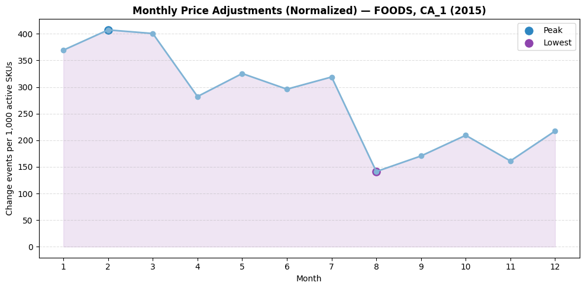
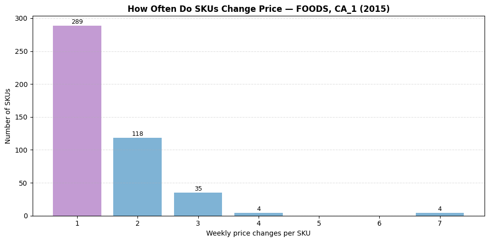
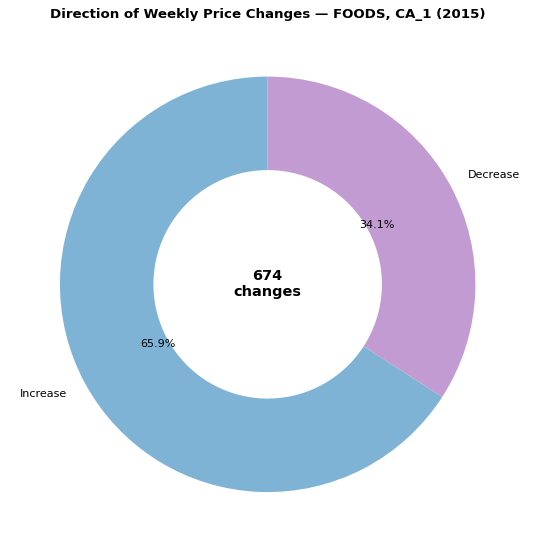

# Data → Decision — Week 1  
## Retail Price Fluctuation Micro Case (M5 Dataset)

### Objective
Analyze whether weekly retail price fluctuations show meaningful patterns in **direction, timing, and concentration** for a single store and product category.

---

## Scope
- **Year:** 2015  
- **Store:** CA_1  
- **Category:** FOODS  
- **Granularity:** Weekly (`wm_yr_wk`)  
- **Dataset:** M5 Forecasting (Public)

---

## Key Questions
- How often do prices change?
- Are price changes mostly increases or decreases?
- Are changes concentrated in a few products or spread out?
- Do certain months show higher volatility?

---

## Key Findings
- ~31% of food items changed price at least once in 2015  
- **Average absolute price change:** ~$0.35  
- **Direction split:** 66% increases vs 34% decreases  
- Most products changed price only 1–2 times; a few changed 4–7 times  
- Price adjustments peaked in **Q1** and were lowest in **late summer**  
- Price changes were **distributed across SKUs**, not dominated by a few

---

## Core Technique Learned
**SQL Window Function — `LAG()`**

Used to compare each week’s price with the previous week’s price without complex self-joins, enabling clean time-series comparison.

---

## Visual Insights

### Monthly Normalized Adjustments

### SKU Price Change Frequency

### Direction of Price Changes

Week1/Retail_Price_Fluctuations/images/download.png
---

## Workflow Summary
1. Filter dataset to scope (store, category, year)
2. Build weekly calendar spine
3. Create week → month mapping to avoid duplication
4. Engineer price change feature using `LAG()`
5. Validate duplicates and data coverage
6. Compute direction, magnitude, and concentration metrics
7. Visualize trends and distribution

---

## Tools & Stack
- **Databricks**
- **SQL**
- **PySpark**
- **Matplotlib**
- **GitHub**

---

## Conclusion
Weekly price changes are **infrequent but directional**, and volatility is **distributed across products rather than concentrated**.  
Window functions significantly simplified time-series analysis and validation.

---

## Notebook
See full workflow here:  
`notebook/week1_retail_price_fluctuation_m5.ipynb`

